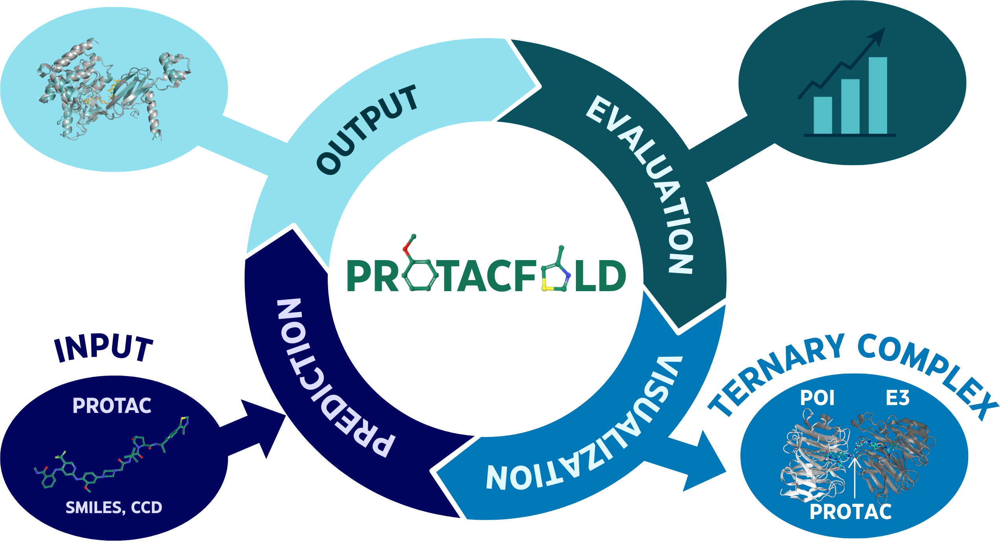

# PROTACFold

[](https://opensource.org/licenses/MIT)
[](https://www.python.org/)
[](https://github.com/google-deepmind/alphafold3)
[](https://doi.org/10.5281/zenodo.14959719)


<div align="center">
  
</div>

## Overview

PROTACFold is a comprehensive toolkit for analyzing and predicting Proteolysis Targeting Chimera (PROTAC) structures using AlphaFold 3. PROTACs are heterobifunctional molecules that induce targeted protein degradation by forming ternary complexes between a protein of interest (POI) and an E3 ubiquitin ligase. This toolkit provides methods for accurate prediction, evaluation, and analysis of these complex structures to advance PROTAC drug discovery.

## Features

- **AlphaFold 3 Integration**: Streamlined setup and usage of AlphaFold 3 for PROTAC ternary complex prediction
- **Multiple Ligand Representation Methods**: Support for both Chemical Component Dictionary (CCD) and SMILES formats
- **Comprehensive Structure Analysis**: Calculate RMSD, DockQ scores, pTM, ipTM, and TM-scores for evaluating model quality
- **Molecular Property Analysis**: Calculate and analyze physicochemical properties of PROTACs using RDKit
- **Advanced Visualization**: Interactive plots and statistical analysis of prediction metrics
- **Benchmark Capabilities**: Compare predictions with experimental structures and other computational methods
- **Format Conversion**: Tools for converting between different molecular structure formats (PDB, CIF)

## Installation

### Prerequisites

- Python 3.11+
- CUDA-compatible GPU (for AlphaFold 3)
- Docker (recommended for AlphaFold 3 setup)

### Using Docker (Recommended)

We use AlphaFold 3 inference code available from [Google DeepMind](https://github.com/google-deepmind/alphafold3).

Our detailed instructions for setting up AlphaFold 3 using Docker can be found in the [installation guide](docs/installation_docker.md). For reference, you can also consult the official [AlphaFold 3 documentation](https://github.com/google-deepmind/alphafold3/blob/main/docs/docker.md), though our guide provides comprehensive step-by-step instructions tailored more for PROTACFold users.

### Manual Installation

1. Clone the repository:
```bash
git clone https://github.com/NilsDunlop/PROTACFold.git
cd PROTACFold
```

2. Install Python dependencies:
```bash
pip install -r requirements.txt
```

## Directory Structure

- `data/`: Contains datasets and analysis results
  - `af3_input/`: Input files for AlphaFold 3 (SMILES and CCD formats)
  - `af3_results/`: Consolidated results from AlphaFold 3 predictions
  - `plots/`: Generated visualizations
  - `hal_04732948/`: Data from [Pereira et al., 2024](https://www.biorxiv.org/content/10.1101/2024.03.19.585735v2) for comparison
- `utils/`: Utility scripts for structure analysis and property calculation
- `notebooks/`: Jupyter notebooks for analysis and visualization
- `docs/`: Documentation including installation guides and images

## Usage

### PROTAC Structure Prediction

Use AlphaFold 3 to predict the structure of PROTAC-mediated ternary complexes:

1. Prepare your input JSON files in either CCD or SMILES format (see examples in `data/af3_input/`)
2. Run AlphaFold 3 using Docker (see installation guide)
3. Analyze results using the provided utility scripts

### Analyzing Prediction Results

```bash
# Calculate RMSD between predicted and reference structures
python utils/rmsd_calculator.py --pred path/to/prediction.pdb --ref path/to/reference.pdb

# Calculate DockQ score for protein-protein interface quality assessment
python utils/compute_dockq.py --pred path/to/prediction.pdb --ref path/to/reference.pdb

# Calculate molecular properties from SMILES
python utils/molecular_properties.py --input data/smiles_file.csv --output results.csv

# Compare prediction metrics across multiple models
python utils/compare_predictions.py --input_dir path/to/predictions --output results.csv
```

### Visualization and Analysis

Explore the Jupyter notebooks for comprehensive analysis workflows:

```bash
jupyter notebook notebooks/af3_analysis.ipynb
```

The notebooks demonstrate:
- Comparative analysis of CCD vs. SMILES-based predictions
- Correlation between confidence metrics (pTM/ipTM) and structural quality
- Component-wise analysis (POI vs E3 ligase interfaces)
- Molecular property distribution of successful PROTACs

## Key Metrics

PROTACFold evaluates predictions using multiple metrics:
- **DockQ Score**: Quality measure for protein-protein docking interfaces
- **RMSD**: Root Mean Square Deviation between predicted and experimental structures
- **pTM/ipTM**: AlphaFold confidence metrics for overall and interface quality
- **Molecular Descriptors**: Physicochemical properties of PROTAC molecules

## Predicted Structures

All predicted structures, as well as two replicas of a 300 ns MD simulation of complex 9B9W, are available on [Zenodo](https://zenodo.org/records/14959719).

## Tools

### Protein Structure Prediction
- **[AlphaFold 3](https://github.com/google-deepmind/alphafold3)** - DeepMind's state-of-the-art protein structure prediction model

### Structure Analysis and Comparison
- **[DockQ](https://github.com/bjornwallner/DockQ)** - Quality measure for protein-protein docking models

### Visualization and Chemoinformatics
- **[PyMOL](https://www.pymol.org/)** - Molecular visualization system
- **[RDKit](https://www.rdkit.org/)** - Open-source chemoinformatics toolkit

## Data Sources

This project integrates data from:
- [Protein Data Bank (PDB)](https://www.rcsb.org/)

## License

This project is licensed under the MIT License - see the [LICENSE](LICENSE) file for details.

## Acknowledgments

- The AlphaFold team at Google DeepMind
- Developers of open-source tools used in this project (RDKit, DockQ)
- PyMOL for visualization
- Contributors to PROTAC databases and experimental data

## Citation

If you use PROTACFold in your research, please cite this repository and relevant tools.