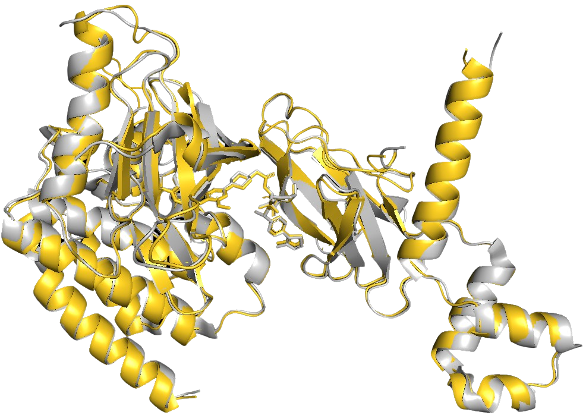
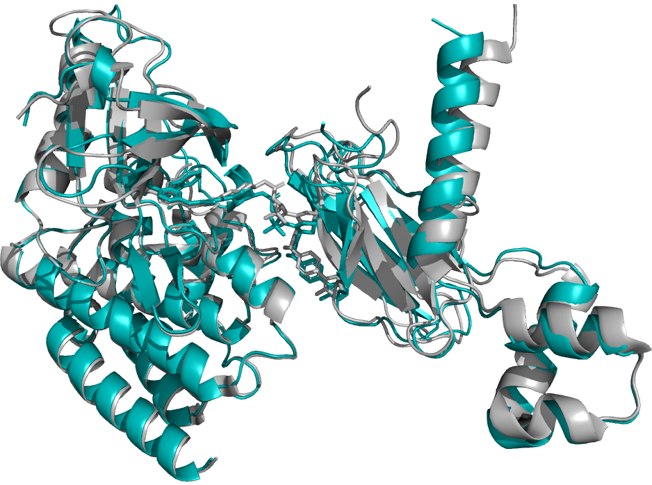

# PROTACFold

<a href="https://opensource.org/licenses/MIT" target="_blank" rel="noopener noreferrer">
  
</a>
<a href="https://www.python.org/" target="_blank" rel="noopener noreferrer">
  
</a>
<a href="https://github.com/google-deepmind/alphafold3" target="_blank" rel="noopener noreferrer">
  
</a>
<a href="https://github.com/jwohlwend/boltz" target="_blank" rel="noopener noreferrer">
  
</a>
<a href="https://zenodo.org/records/15848838" target="_blank" rel="noopener noreferrer">
  
</a>


<div align="center">
  
</div>

## Overview

PROTACFold is a comprehensive toolkit for analyzing and predicting Proteolysis Targeting Chimera (PROTAC) structures using AlphaFold 3 and Boltz-1. PROTACs are heterobifunctional molecules that induce targeted protein degradation by forming ternary complexes between a protein of interest (POI) and an E3 ubiquitin ligase. This toolkit provides methods for accurate prediction, evaluation, and analysis of these complex structures and models to advance PROTAC drug discovery.

## Table of Contents

- [Overview](#overview)
- [Website](#website)
- [Features](#features)
- [Installation](#installation)
  - [Prerequisites](#prerequisites)
  - [AlphaFold 3 Setup (Docker Recommended)](#alphafold-3-setup-docker-recommended)
  - [Using Boltz-1](#using-boltz-1)
  - [Manual Installation](#manual-installation)
- [Directory Structure](#directory-structure)
- [Usage](#usage)
  - [PROTAC Structure Prediction](#protac-structure-prediction)
  - [Comprehensive Structure Evaluation](#comprehensive-structure-evaluation)
  - [Visualization and Plotting](#visualization-and-plotting)
- [Key Metrics](#key-metrics)
- [Predicted Structures](#predicted-structures)
- [Tools](#tools)
- [Data Sources](#data-sources)
- [License](#license)
- [Acknowledgments](#acknowledgments)
- [Citation](#citation)

## Website

To make PROTAC analysis more accessible, we have launched **[protacfold.xyz](https://protacfold.xyz)**, our web platform that automates PDB extraction, identifies PROTAC POI and E3 ligase components, and prepares input files for both AlphaFold 3 and Boltz-1.

<div align="center">
  <a href="https://protacfold.xyz" target="_blank" rel="noopener noreferrer">
    
  </a>
</div>

## Features

- **AF3 & B1 Integration**: Streamlined setup and usage of both AlphaFold 3 and Boltz-1 for comparative PROTAC ternary complex prediction.
- **Multiple Ligand Representation Methods**: Support for both Chemical Component Dictionary (CCD) and SMILES formats
- **Comprehensive Structure Analysis**: Calculate RMSD, DockQ scores, pTM, ipTM, and TM-scores for evaluating model quality
- **Molecular Property Analysis**: Calculate and analyze physicochemical properties of PROTACs using RDKit
- **Advanced Visualization**: Interactive plots and statistical analysis of prediction metrics
- **Benchmark Capabilities**: Compare predictions with experimental structures and other computational methods

## Installation

### Prerequisites

- Python 3.11+
- CUDA-compatible GPU (for AlphaFold 3)
- Docker (recommended for AlphaFold 3 setup)

### AlphaFold 3 Setup (Docker Recommended)

We use AlphaFold 3 inference code available from [Google DeepMind](https://github.com/google-deepmind/alphafold3).

Our detailed instructions for setting up AlphaFold 3 using Docker can be found in the [installation guide](docs/installation_docker.md). For reference, you can also consult the official [AlphaFold 3 documentation](https://github.com/google-deepmind/alphafold3/blob/main/docs/docker.md), though our guide provides comprehensive step-by-step instructions tailored more for PROTACFold users.

### Boltz-1 Setup

Install Boltz using pip:
```bash
pip install boltz -U
```

To run predictions with Boltz YAML input files, please refer to the detailed instructions in the official [Boltz Prediction Guide](https://github.com/jwohlwend/boltz/blob/main/docs/prediction.md).

### Manual Installation

1. Clone the repository:
```bash
git clone https://github.com/NilsDunlop/PROTACFold.git
cd PROTACFold
```

2. Install Python dependencies:
```bash
pip install -r requirements.txt
```

## Directory Structure

- `data/`: Contains datasets and analysis results
  - `af3_input/`: Input files for AlphaFold 3 (SMILES and CCD formats)
  - `af3_results/`: Consolidated results from AlphaFold 3 predictions
  - `boltz_results/`: Consolidated results from Boltz-1 predictions
  - `plots/`: Generated visualizations
  - `hal_04732948/`: Data from [Pereira et al., 2024](https://www.biorxiv.org/content/10.1101/2024.03.19.585735v2) for comparison
- `utils/`: Utility scripts for structure analysis and property calculation
- `src/`:
  - `plots/`: Scripts for generating all figures and data for our research.
  - `website/`: Local deployment of `protacfold.xyz` for private analysis using Ollama.
- `docs/`: Documentation including installation guides and images

## Usage

### PROTAC Structure Prediction

Proposed workflow for predicting PROTAC ternary complexes using AlphaFold 3 and Boltz-1:

1. Determine PDB structures to analyze and automate JSON and YAML input files with [`protacfold.xyz`](https://protacfold.xyz).
2. Run AlphaFold 3 and Boltz predictions.
3. Analyze results using the provided utility scripts.

### Structure Prediction Evaluation

The `utils/evaluation.py` script automates the extraction of all quantitative metrics from our study (see [Key Metrics](#key-metrics)). It uses the `(PDBID)_analysis.txt` files (generated by `protacfold.xyz`) to identify POI and E3 ligase chains, enabling fully automated, component-wise RMSD calculations with PyMOL.

**Note**: Script requires a local installation of [PyMOL](https://pymol.org/) for structural alignments.

To run a complete analysis on a directory of PROTAC predictions:

```bash
# Analyze all AlphaFold 3 predictions in a given directory
python utils/evaluation.py --protac path/to/predictions --model_type AlphaFold3

# Analyze all Boltz-1 predictions in a given directory
python utils/evaluation.py --boltz path/to/predictions --model_type Boltz1
```

This will generate an `evaluation_results.csv` file in the `data/af3_results/` directory.

### Visualization and Plotting

The `src/plots/` directory contains all the scripts used to generate the figures and perform the data analysis for our research. These scripts produce a variety of visualizations and can be ran by:

```bash
python src/plots/main.py
```

## Key Metrics

PROTACFold evaluates predictions using multiple metrics:
- **DockQ Score**: Quality measure for protein-protein docking interfaces
- **RMSD**: Root Mean Square Deviation between predicted and experimental structures
- **pTM/ipTM**: AlphaFold confidence metrics for overall and interface quality
- **Molecular Descriptors**: Physicochemical properties of PROTAC molecules

## Predicted Structures

All 124 predicted PROTAC structures, as well as two replicas of a 300 ns MD simulation of complex 9B9W, are available on [Zenodo](https://zenodo.org/records/15848838). An example of a high-quality prediction, the structure for complex [7PI4](https://www.rcsb.org/structure/7PI4) is shown below. The ground truth is in grey, with the AlphaFold 3 prediction in gold and the Boltz-1 prediction in cyan.

<div align="center">
<table>
  <tr>
    <td align="center"><b><font color="#cda61a">AlphaFold3</font></b></td>
    <td align="center"><b><font color="#008080">Boltz-1</font></b></td>
  </tr>
  <tr>
    <td></td>
    <td></td>
  </tr>
</table>
</div>

## Tools

### Protein Structure Prediction
- **[AlphaFold 3](https://github.com/google-deepmind/alphafold3)** - DeepMind's state-of-the-art protein structure prediction model

- **[Boltz-1](https://github.com/jwohlwend/boltz)** - MIT researchers open source biomolecular interaction model

### Structure Analysis and Comparison
- **[DockQ](https://github.com/bjornwallner/DockQ)** - Quality measure for protein-protein docking models

### Visualization and Chemoinformatics
- **[PyMOL](https://www.pymol.org/)** - Molecular visualization system
- **[RDKit](https://www.rdkit.org/)** - Open-source chemoinformatics toolkit

## Data Sources

This project integrates data from:
- [Protein Data Bank (PDB)](https://www.rcsb.org/)

## License

This project is licensed under the MIT License - see the [LICENSE](LICENSE) file for details.

## Acknowledgments

- The AlphaFold team at Google DeepMind
- The Boltz researchers at MIT
- Developers of open-source tools used in this project (RDKit, DockQ)
- PyMOL for visualization
- Contributors to PROTAC databases and experimental data

## Citation

If you use PROTACFold in your research, please cite the paper: [Predicting PROTAC-Mediated Ternary Complexes with AlphaFold3 and Boltz-1](https://chemrxiv.org/engage/chemrxiv/article-details/686ee8f943bc52e4ec1fbec2)